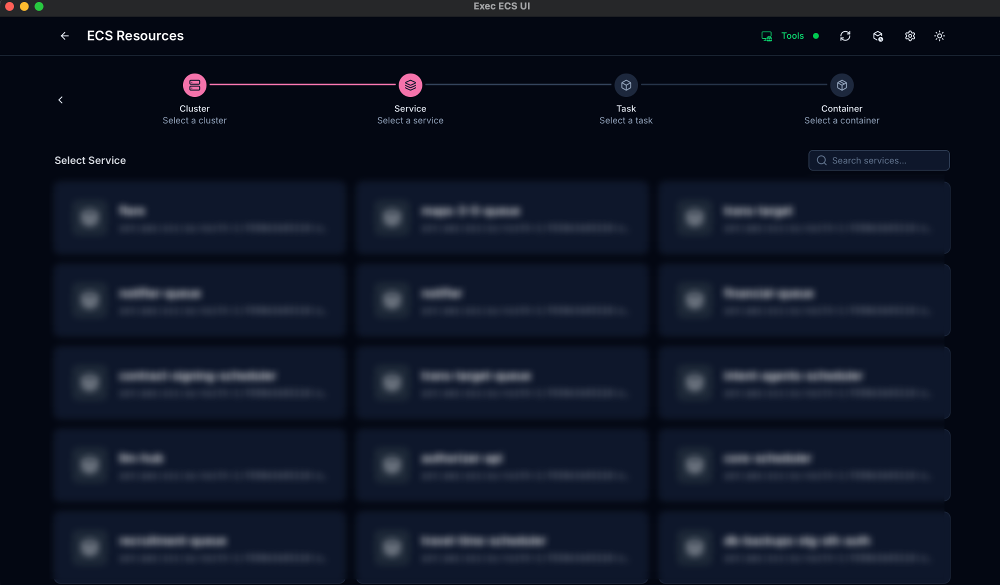

<p align="center">
    
</p>
<h1 align="center">Exec ECS UI</h1>
<p align="center">
A modern desktop application for managing AWS ECS Exec sessions
<br>
Built with <a href="https://nuxt.com">Nuxt 4</a> and <a href="https://v2.tauri.app">Tauri 2</a>
</p>

<br />

<p float="left">
	
	
</p>

<br />

<div align="center">

</div>

<br />

## Overview

Exec ECS UI is a desktop application that provides a user-friendly interface for connecting to AWS ECS containers via ECS Exec. It eliminates the need for complex CLI commands and provides a streamlined experience for managing ECS Exec sessions.

## Features

- **AWS SSO Integration** - Sign in with AWS SSO profiles
- **ECS Resource Browsing** - Browse clusters, services, tasks, and containers with an intuitive stepper interface
- **Interactive Terminal** - Embedded xterm.js terminal for executing commands inside containers
- **Command History** - View and re-run your last 10 unique exec sessions
- **Modern UI** - Clean, monochrome interface with dark mode support
- **Search & Filter** - Quick search across all resources
- **Persistent Settings** - Remembers your last selected profile and region
- **Fast & Lightweight** - Built with Tauri 2 for native performance

## Prerequisites

Before using Exec ECS UI, ensure you have:

1. **AWS CLI v2** installed and configured
   ```sh
   aws --version
   ```

2. **Session Manager Plugin** installed
   ```sh
   session-manager-plugin --version
   ```
   Install from: https://docs.aws.amazon.com/systems-manager/latest/userguide/session-manager-working-with-install-plugin.html

3. **AWS SSO Profiles** configured in `~/.aws/config`
   ```ini
   [profile your-profile]
   sso_start_url = https://your-sso-portal.awsapps.com/start
   sso_region = us-east-1
   sso_account_id = 123456789012
   sso_role_name = YourRole
   region = eu-north-1
   ```

4. **Rust** (for building from source)
   - Follow [Tauri prerequisites](https://tauri.app/start/prerequisites)

5. **Node.js** (>=23) and **bun** (>=1.2.22)

## Installation

### From Source

```sh
# Clone the repository
git clone https://github.com/NicolaSpadari/exec-ecs-ui.git
cd exec-ecs-ui

# Install dependencies
bun install

# Run in development mode
bun run tauri:dev
```

### Build for Production

```sh
# Build the application
bun run tauri:build
```

The built application will be available in `src-tauri/target/release/bundle/`.

## Usage

1. **Sign In**
   - Select your AWS SSO profile from the dropdown
   - Enter your default region (defaults to `eu-north-1`)
   - Click "Sign in" to authenticate with AWS SSO

2. **Browse Resources**
   - Select a cluster from the list
   - Choose a service
   - Pick a task
   - Select a container

3. **Start Exec Session**
   - Click "Exec" on a running container
   - An interactive terminal will open
   - Execute commands directly in the container

4. **View History**
   - Click the history icon in the header
   - View your last 10 exec sessions
   - Re-run or delete saved sessions

## Technologies

- **Frontend**: Nuxt 4, Vue 3, Nuxt UI 4
- **Backend**: Tauri 2 (Rust)
- **Terminal**: xterm.js
- **Styling**: Tailwind CSS v4
- **State Management**: Pinia
- **Package Manager**: Bun

## Project Structure

```
exec-ecs-ui/
├── app/
│   ├── pages/          # Vue pages (index, browse, console, history)
│   ├── components/     # Reusable Vue components
│   ├── stores/         # Pinia stores (aws, history)
│   └── assets/         # CSS and static assets
├── src-tauri/
│   ├── src/
│   │   ├── aws.rs      # AWS CLI integration
│   │   ├── terminal.rs # Terminal session management
│   │   └── lib.rs      # Tauri entry point
│   └── Cargo.toml      # Rust dependencies
└── package.json        # Node.js dependencies
```

## Development

```sh
# Start development server
bun run tauri:dev

# Run frontend only (for UI development)
bun run dev

# Build for production
bun run tauri:build

# Build with debug symbols
bun run tauri:build:debug

# Lint code
bun run lint
```

## Configuration

The application stores configuration locally:

- **Settings**: `~/.settings.dat` (last selected profile and region)
- **History**: `~/.history.dat` (exec session history)

## Troubleshooting

### Session Manager Plugin Not Found
- Ensure the Session Manager Plugin is installed and in your PATH
- Verify installation: `session-manager-plugin --version`

### Empty Cluster List
- Verify your AWS credentials are valid: `aws sts get-caller-identity`
- Check that your profile has permissions to list ECS clusters
- Ensure the region is correct

### SSO Login Timeout
- The login process has a 5-minute timeout
- If it gets stuck, click "Cancel" and try again
- Ensure your browser allows popups for the SSO URL

## Contributing

Contributions are welcome! Please feel free to submit a Pull Request.

## License

MIT License © 2024-PRESENT [NicolaSpadari](https://github.com/NicolaSpadari)
